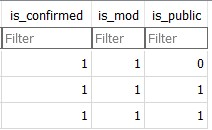

# VRCStats

## Table of Contents

- [VRCStats](#vrcstats)
  - [Table of Contents](#table-of-contents)
  - [Introduction](#introduction)
  - [Features](#features)
  - [Installation](#installation)
  - [Usage](#usage)

## Introduction

VRCStats is a website designed to track and analyze statistics related to dogfighting in VRChat. Inspired by the need for a true ranking system to measure skill, this project aims to provide an intuitive platform for virtual pilots to gauge their performance and engage in competitive play.

VRCStats seeks to fill the gap by offering a dedicated website where players can create accounts, log their dogfighting statistics, and view their rankings based on various performance metrics. This includes factors such as win-loss ratios and overall skill rating.

## Features

* Create and host matches
* Track personal statistics
* See global matches history
* See leaderboards

## Installation

To install and set up VRCStats, follow these steps:

Clone the repository using Git:

**git clone** https://github.com/your-username/VRDogfightTracker.git

Navigate to the project directory:

cd VRCStats

Install the required dependencies in **requirements.txt**.
This will install all the necessary packages and dependencies required by the project.

Start the local server for testing:

Run hello.py

Open a web browser and visit http://192.168.31.100:5000/ to access the VRCStats website.

## Usage

* To have access to the mod only pages (/matchmaking), you need to register
* In the project files navigate to the **db** folder
* **users.db** database contains registered users, every user has
*is_confirmed*, *is_mod* and *is_public* values

* You need to change *is_confirmed* and *is_mod* values from **0** to **1** 
* DB Browser is used for this example
